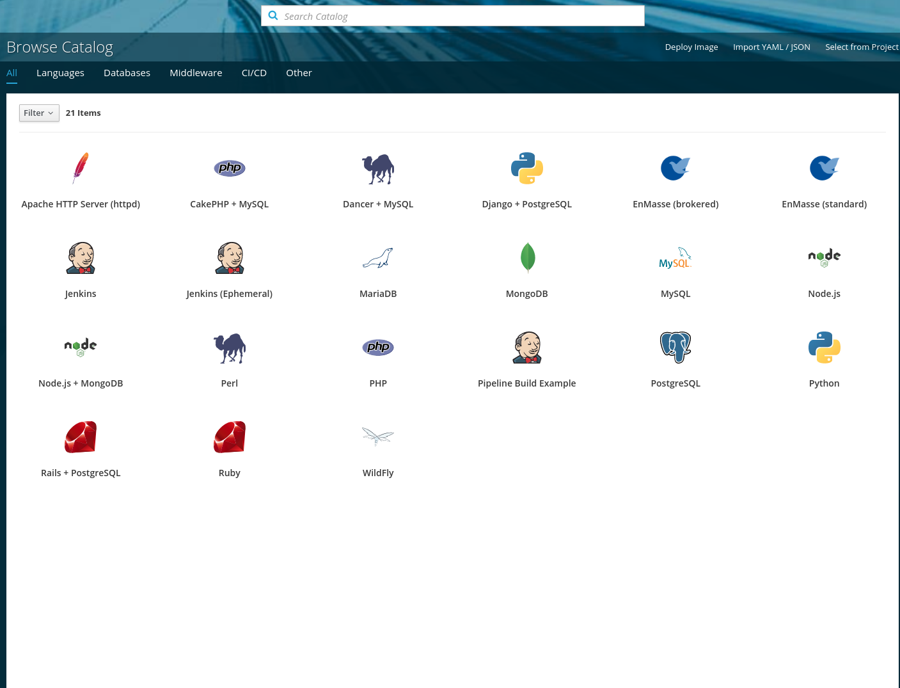
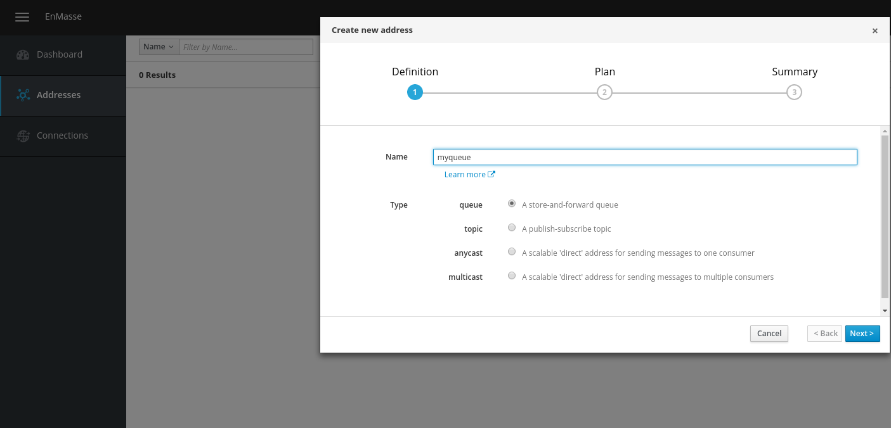
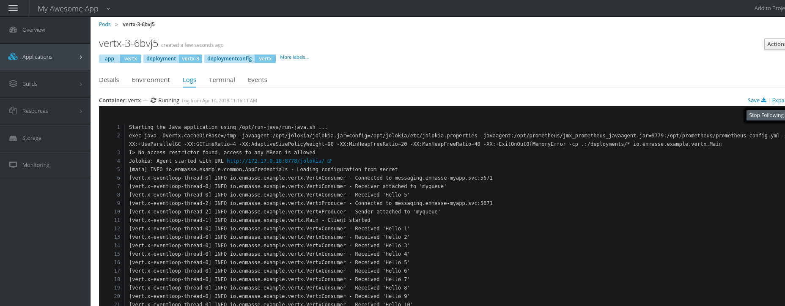

# Messaging using OpenShift Service Catalog

This tutorial walks you through provisioning messaging infrastructure and deploying example messaging clients using that messaging infrastructure based on OpenShift Service Catalog.

## Provision Address Space

In the OpenShift Service Catalog overview, select either of "EnMasse (standard)" or "EnMasse (brokered)".

Select among the available plans. If you have an OpenShift project on this cluster already, select it in the "Add to Project" field. If not, select the "Create Project" in the drop-down box.

Use the same value for the "name" field. The address space will be provisioned and may take a few minutes. In the meantime, you can go to the next step of deploying the example application.

Skip binding at this point, we will perform the bind later.

If you go to your project, you should see the service provisioning in progress.

### Create addresses

Once the service is provisioned, a link to the dashboard will be displayed on the provisioned service. 

Click the dashboard link, which will redirect you to a keycloak login page. Click on 'OpenShift' which will allow you to login using OpenShift credentials. Once logged in, you should be able to access the messaging console.  Click on the "Addresses" menu item and create an address named `myqueue` of type `queue`. You can also create other addresses if you modify the client examples accordingly.

## Deploying example application

This tutorial provides 2 java-based example applications (but any client compliant with the AMQP 1.0 standard should work). One client is based on Vert.x and the other on JMS. You can edit the examples to change the messaging address to use (hardcoded to 'myqueue').

The examples are built using maven and deployed using the Fabric8 Maven Plugin.

*NOTE* First make sure you are logged in to the OpenShift cluster and have current-project set to your project.

To deploy the examples, first go to the top level directory `java` and build everything:

    mvn install

To deploy either vert.x or JMS example, go to `vertx` or `jms` respectively and run the following commands:

    mvn -Dfabric8.mode=openshift package fabric8:build
    mvn fabric8:resource fabric8:deploy

The example application will now be built and deployed in your OpenShift project. 

For now, the examples will restart since they cannot detect any credentials, which we will fix in the next step.

## Bind to app

Once messaging has been provisioned, it is time to create a binding.

to create the addresses in the messaging console. Once the binding is created, you will see new secret created in your project.

### Add credentials to app

Once the queue has been created, go back to the OpenShift console. Go to the secret that was created and click "Add to application". This will allow you modify your application deployment to mount the secret so that the example application can use it. Select the option to mount it and enter `/etc/app-credentials` as the mount point.

Once the secret has been added to the deployment, a new version of your app will be deployed, and the clients should start to send and receive messages. You can confirm that it is working by looking at the logs for the example application pod.

## Deleting

You can delete bindings and the provisioned service in the console, which will delete resources consumed by the service.

## Summary

In this tutorial, you've seen how to provision messaging using the OpenShift Service Catalog. You have seen how to use the messaging console to create an address.  You have also deployed an example messaging application and bound it to the provisioned messaging service. Finally, you modified the application to use the secret for authenticating to the messaging service.
